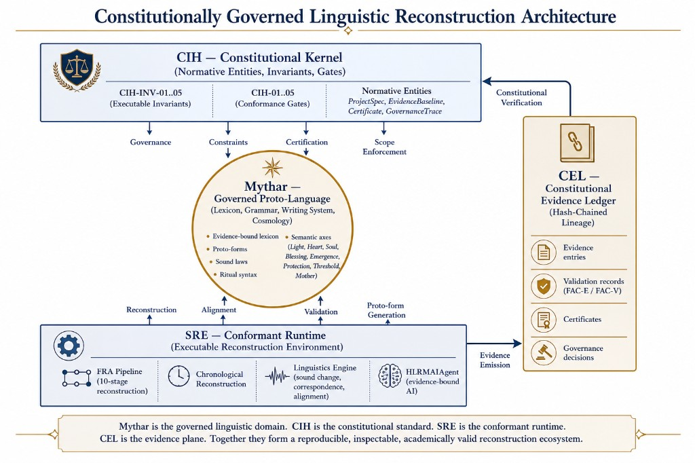
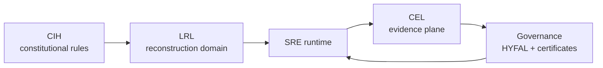

# Constitutional Reference Architecture (CRA) v1.0

**Components:** CIH · CEL · LRL · Conformant runtimes · Governance

| Document | Path |
|----------|------|
| CIH Constitution | `docs/specs/CIH_ConstitutionalSpecification_v1.md` |
| CIH Kernel | `docs/architecture/CIH_ConstitutionalKernel_v1.md` |
| LRL Specification | `docs/specs/LRL_Specification_v1.md` |
| CEL Charter | `docs/governance/CEL_Charter_v01.md` |
| SRE Conformance Profile | `docs/conformance/SRE_ConformanceProfile_v1.json` |



---

## 1. Purpose

The Constitutional Reference Architecture (CRA) describes the layered structure of a constitutional computing ecosystem, separating normative legitimacy from operational confidence.

It integrates:

- CIH (constitutional kernel)
- CEL (evidence plane)
- LRL (reconstruction domain)
- Conformant runtimes (e.g., SRE)
- Governance actors

---

## 2. Two graphs: Justification and Evidence

### 2.1 Justification Graph (Normative Legitimacy)

Flow:

```
Axioms → Principles → Doctrines → Architecture → Specifications → Implementations
```

CIH Constitution and CIH Kernel live in this graph.

### 2.2 Evidence Graph (Operational Confidence)

Flow:

```
Implementations → Evidence → Assurance → Conformance → Governance
```

CEL and CIH Conformance Profiles live in this graph.

CRA explicitly separates:

- **Legitimacy** (why the system is justified)
- **Confidence** (why the system is trusted in practice)

---

## 3. Layers

### 3.1 Constitutional Layer (CIH)

- CIH Constitution
- CIH Constitutional Kernel
- CIH Conformance Requirements

**Role:**

- Define normative entities, invariants, and gates.
- Provide implementation-neutral constitutional standard.

### 3.2 Domain Layer (LRL)

- Linguistic Reconstruction Layer
- Reconstruction languages (Mythar, IE corpus)
- FRA pipeline
- Linguistics engine
- Evidence-bound AI

**Role:**

- Provide the primary governed domain.
- Serve as the reason the constitutional stack exists.
- Mythar Living Lexicon entries carry CRA governance metadata (`cra_governance`: identity, justification/evidence dependencies, assurance, lifecycle, deferred CEL lineage, revision history). See `docs/architecture/MytharGapFill.md`, `docs/architecture/MytharWhitePaper.md`, and `src/sre/mythar/governance.py`. CEL binding remains deferred until ledger IDs are written (Drive G).

### 3.3 Runtime Layer (SRE and peers)

- Conformant runtimes implementing CIH.
- Services:
  - EvidenceRegistry
  - ChronologicalReconstruction
  - HLRMAIAgent
  - CIH service
  - CEL writer
  - Explorer UI

**Role:**

- Execute governed processes.
- Emit evidence and certificates.
- Maintain conformance profiles.

### 3.4 Evidence Plane (CEL)

- Constitutional Evidence Ledger.
- Entry types:
  - `governance`
  - `certification`
  - `evidence`
  - `validation`
  - `attestation`
  - `correspondence`
  - `hypothesis`

**Role:**

- Operationalize the Evidence Graph.
- Provide hash-chained, append-only records.
- Enable independent audit and reconstructability.

### 3.5 Governance Layer

- HYFAL Executive Council.
- Sovereign Certificate Authority.
- GovernanceConsensusMap.

**Role:**

- Interpret CIH.
- Approve/reject projects.
- Issue/revoke certificates.
- Consume CEL evidence to maintain confidence.

---

## 4. CIH–LRL–CEL–Runtime relationship

Textual flow:

1. **CIH** defines the constitutional rules.
2. **LRL** defines the reconstruction domain under those rules.
3. **Runtime (SRE)** implements CIH and LRL.
4. **CEL** records the evidence and lineage of runtime behavior.
5. **Governance** uses CEL to evaluate conformance and issue certificates.



---

## 5. Interoperability

CRA is designed so that:

- CIH remains implementation-neutral.
- LRL can be instantiated for different domains (other language families, other governed domains).
- Multiple runtimes can implement CIH and LRL independently.
- CEL provides a shared evidence substrate.
- Governance actors can evaluate any conformant runtime via its conformance profile and CEL records.

---

## 6. Reference implementation

SRE v1.0 is the first CRA-conformant runtime:

- CIH conformance declared via `docs/conformance/SRE_ConformanceProfile_v1.json`.
- LRL instantiated with Mythar and IE corpus.
- CEL implemented as the Evidence Plane.
- Governance path observable end-to-end via Sovereign Ledger Explorer.

Future runtimes may implement different language families (Proto-Semitic, Proto-Uralic, Proto-Bantu, Proto-Sino-Tibetan, Proto-Turkic) or entirely different governed domains (historical ontology, manuscript collation, comparative mythology) while sharing the same CIH constitutional kernel and CEL evidence substrate. Each runtime publishes its own conformance profile declaring which LRL instantiation it supports and which extensions it provides beyond core CIH.
