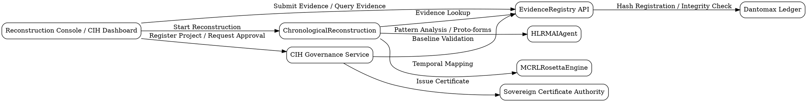

# Governance Consensus Map v0.1

Encodes who must agree for a reconstruction to be valid, where consensus is recorded, and how evidence / AI / governance bind.

## Nodes

- HYFAL Executive Council
- CIH Service
- EvidenceRegistry
- Sovereign Certificate Authority
- Sovereign Ledger Explorer
- Governance Trace Engine

## Edges (consensus flows)

| From | To | Provides |
|------|-----|----------|
| EvidenceRegistry | CIH Service | Evidence Baseline Report (FAC-E1–E4) |
| CIH Service | HYFAL Council | ProjectSpec, Baseline, Architecture Review |
| HYFAL Council | Certificate Authority | Approval decision + constraints |
| Certificate Authority | Ledger Explorer | Certificate record + signatures |
| CIH Service | Governance Trace Engine | Full governance trace |
| Governance Trace Engine | Ledger Explorer | Trace hashes |
| EvidenceRegistry | Governance Trace Engine | Evidence events |

## ASCII summary

```
EvidenceRegistry ──► CIH Service ──► HYFAL Council ──► Cert Authority ──► Ledger
        │                    │                 │                 │
        └────────► Governance Trace Engine ─────┴───────────────┘
```

## GraphViz — Governance Consensus Map

```dot
digraph GovernanceConsensusMap_v01 {
    rankdir=LR;
    node [shape=box, style=rounded];

    EvidenceRegistry           [label="EvidenceRegistry"];
    CIHService                 [label="CIH Service"];
    HYFALCouncil               [label="HYFAL Executive Council"];
    CertAuthority              [label="Sovereign Certificate Authority"];
    LedgerExplorer             [label="Sovereign Ledger Explorer"];
    GovTraceEngine             [label="Governance Trace Engine"];

    EvidenceRegistry -> CIHService       [label="Evidence Baseline (FAC-E1–E4)"];
    CIHService       -> HYFALCouncil     [label="ProjectSpec + Baseline + Arch Review"];
    HYFALCouncil     -> CertAuthority    [label="Approval Decision + Constraints"];
    CertAuthority    -> LedgerExplorer   [label="Certificate Record + Signatures"];
    CIHService       -> GovTraceEngine   [label="Governance Events"];
    GovTraceEngine   -> LedgerExplorer   [label="Trace Hashes"];
    EvidenceRegistry -> GovTraceEngine   [label="Evidence Events"];
}
```



## GraphViz — Service Topology


